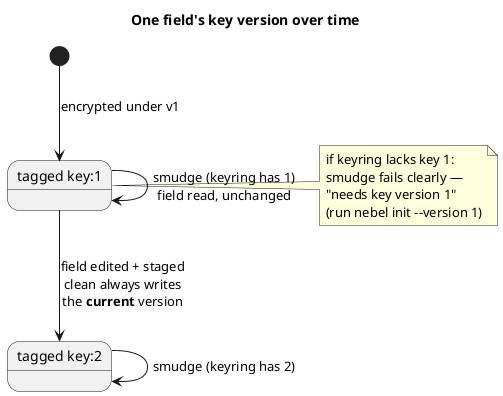

# Spec 11 — `nebel rotate`

Mint a new, current key version without rewriting already-encrypted
content. See REQUIREMENTS.md § Key rotation.

## Model

One current key per revision; several versions can be in play across a
project's history. Every `ENC[...]` value/file tag names the version
that produced it. `clean` always encrypts with the *current* version;
`smudge` decrypts with whichever version a tag names. Each machine keeps
every version it has ever derived in a small local keyring, not just one
key.

`rotate` itself only performs the top edge of this diagram (mint version
2, current becomes 2); every other transition happens later, driven by
ordinary edits (spec 06) and `nebel init --version N` (spec 07).

## Acceptance criteria

- **AC-11.1 Requires a valid current key**: `rotate` requires the local
  keyring to hold an entry for the config's *current* `key_version` that
  verifies against the current canary. With no such entry, it fails with
  a clear error naming `nebel init`.
- **AC-11.2 Version bump**: `rotate` increments `key_version` by 1,
  generates a fresh salt, derives a new key from a new password, and
  writes a new canary — replacing the previous values in `.nebel.yaml`.
  `rules` is left unchanged.
- **AC-11.3 New password input**: same source precedence and
  restrictions as `init` (spec 07 § Password input): `--password-stdin`,
  then `$NEBEL_PASSWORD`, else a freshly generated passphrase printed
  exactly once; a positional password argument is refused; no
  interactive prompt fallback.
- **AC-11.4 No rewrite of existing content**: `rotate` does not decrypt,
  re-encrypt, or touch any already-encrypted file or field — existing
  ciphertext keeps decrypting under whatever version it already carries.
- **AC-11.5 Keyring updated additively**: the new version's key is added
  to the local keyring; no previously cached version is removed or
  overwritten, so the machine that rotated can still read everything it
  could read before.
- **AC-11.6 Stages only the config**: `rotate` runs `git add` on
  `.nebel.yaml` only, since AC-11.4 means nothing else changed. The
  operator commits explicitly.
- **AC-11.7 Output states the consequences**: output names the new
  version, and states plainly that (a) existing content is unaffected and
  migrates only as it's next edited, (b) other clones/CI need `nebel
  init` again to write under the new version (their reads of old content
  are unaffected), and (c) no version's password should be discarded
  while `nebel status` still reports content depending on it.
- **AC-11.8 No secrets printed**: output never includes decrypted values
  — only the version number and, when generated, the new password
  (printed exactly once).
- **AC-11.9 Not idempotent, by design**: running `rotate` again right
  after a successful rotation succeeds and mints a third, independent
  version — there is no "already rotated" state to converge on.
- **AC-11.10 Forcing convergence on untouched content**: a file whose
  plaintext hasn't changed is never re-staged by a plain `git add` —
  git's stat cache skips re-running `clean` when content looks unchanged,
  so lazy convergence (AC-11.4) never reaches it on its own. `git add
  --renormalize -- <path>` is the supported way to force it: `clean`
  always writes the current version regardless of a field's prior tag
  (spec 06), so renormalizing produces new ciphertext and stages it even
  with zero plaintext change. No new nebel command is needed for this —
  document it as the escape hatch for deliberately retiring an old
  version's last dependents (surfaced by `nebel status`).
